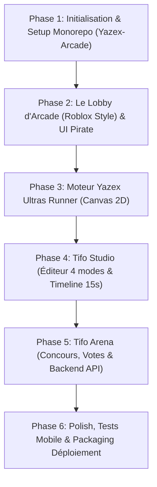

# 🏴‍☠️ Yazex Arcade Hub — Implementation Plan

Plateforme de jeux web indépendante (MERN Stack) dédiée à l'écosystème **Yazex Ship**, conçue comme un cadeau surprise clé en main pour le fondateur. Elle intègre un lobby d'arcade thématique ("Roblox-like") et **2 jeux exclusifs** à fort impact culturel et viral :
1. **Yazex Ultras Runner** : Jeu de course d'arcade 2D (style Chrome Dino Ultras).
2. **Tifo Studio & Arena** : Outil sandbox de création de Tifos (Chorégraphie, Voile قماش, Mixte, 3D multi-scènes), simulation de stade en 15s et plateforme de concours/votes communautaires.

---

## 🏗️ Architecture & Emplacement du Projet

- **Localisation** : `D:\Programmation\Project-Web\yazex-games`
- **Structure Monorepo découplée** :
  ```text
  yazex-games/
  ├── client/                  # React 18 + Vite + TailwindCSS + Canvas 2D + Framer Motion
  │   ├── src/
  │   │   ├── assets/         # Sprites pirate, textures fumigène/signal, bâche قماش
  │   │   ├── components/     # UI Lobby, Navbar pirate, Modales de récompenses
  │   │   ├── games/
  │   │   │   ├── runner/     # Moteur Canvas Yazex Ultras Runner
  │   │   │   └── tifo-studio/# Moteur Tifo Studio, Canvas de simulation, Timeline
  │   │   ├── pages/          # Lobby, GameView, TifoArena (Concours & Votes)
  │   │   └── context/        # PlayerContext (pseudo, allégeance club, scores, coupons)
  └── server/                  # Node.js + Express + MongoDB (Mongoose)
      ├── controllers/        # Scores, Coupons, Tifo Submissions & Votes
      ├── models/             # Player, Score, TifoSubmission, Competition
      └── routes/             # API REST
  ```

---

## 🎮 Détail des 2 Jeux

- **Direction Artistique & Moteur** : **2.5D Premium ("Juiced Arcade")**
  - **Profondeur par Parallax Scrolling** : Défilement multi-plans (sol rapide, conteneurs/rues à mi-distance, baie d'Alger et grues portuaires défilant lentement en fond).
  - **Éclairage Dynamique Canvas** : Les fumigènes et signaux projettent des halos lumineux rouges et dorés en temps réel sur le sol et la mascotte pirate via `globalCompositeOperation = 'screen'`.
  - **Performance & Stabilité** : 60 FPS constants, zéro dépendance 3D lourde, temps de chargement < 1s sur réseau 4G algérien et compatibilité 100% smartphones (zéro crash WebGL).
- **Le Personnage** : Mascotte pirate Yazex (bicorne + cache-œil + sabres).
- **Contrôles** :
  - **ESPACE / Flèche Haut / Tap écran** : Saut classique.
  - **Flèche Bas / Swipe bas** : Glissade / Se baisser (*Duck*).
- **Les 3 Obstacles** :
  1. **Fumigène au sol** (*Hand flare*) : Flamme rougeoyante et fumée au sol $\to$ Saut nécessaire.
  2. **Signal aérien** (*Rocket flare*) : Fusée sifflante descendant en cloche depuis le ciel $\to$ Glissade nécessaire.
  3. **Barrière / Fourgon de police** : Obstacle large au sol $\to$ Grand saut avec timing précis.
- **Récompense E-Commerce & Découplage Strict** :
  - Dès qu'un palier est atteint (ex: 500 pts dans le Runner, ou victoire dans Tifo Arena), le joueur reçoit une pop-up parchemin avec son **Code Promo** généré (ex: `YAZEX500`, `PIRATE10`) avec bouton "Copier le code" et redirection vers le shop.
  - **Règle absolue pour l'instant** : **Zéro modification sur le code de Yazix Ship**. Le projet de jeux reste 100% autonome et découplé. L'intégration de la validation de ces codes dans le checkout de Yazix Ship ne se fera que plus tard, une fois la surprise validée par ton ami.
  - Sauvegarde du meilleur score dans le Leaderboard global.

---

### 2. 🎨 Tifo Studio & Arena (Metteur en Scène de Virage & Concours)

- **Le Studio de Création (Sandbox)** :
  1. **Chorégraphie Pure** : Éditeur de grille pour disposer les feuilles/plastiques de couleur sur la tribune.
  2. **Le Voile Géant (قماش)** : Module d'upload d'image (création perso ou IA) plaquée sur une bâche géante texturée avec plis de tissu réalistes.
  3. **Mixte** : Voile central avec ailes chorégraphiées.
  4. **Tifo 3D Multi-Scènes** : Upload d'éléments découpés (maillot/tricot, sabres, trophée) animés sur des câbles verticaux.
- **La Timeline Séquentielle (10 à 15 secondes)** :
  - Barre de montage intuitive par keyframes :
    - *Étape 1* : Montée du voile / maillot (0s-4s).
    - *Étape 2* : Révélation de la choré en arrière-plan (4s-8s).
    - *Étape 3* : Allumage pyrotechnique des fumis latéraux (8s-12s).
- **Le Lecteur de Simulation** :
  - Caméra face à la tribune avec ambiance audio de foule, tambours et fumée animée.
- **Tifo Arena (Compétitions & Votes)** :
  - Galerie des tifos soumis par la communauté.
  - Système de vote public (1 vote par utilisateur avec restriction IP/localStorage).
  - Module d'export (vidéo / image) pour partage TikTok et Instagram.

---

## 🛠️ Plan d'Exécution par Phases



### Phase 1 : Initialisation & Monorepo
- Initialiser le projet dans `D:\Programmation\Project-Web\Yazex-Arcade`.
- Setup Vite + React 18, Tailwind CSS, configuration des polices (*Bebas Neue*, *Foda* pour l'arabe, *Cinzel/Pirate*).
- Setup du backend Express + MongoDB minimal pour persister scores et tifos.

### Phase 2 : Le Lobby d'Arcade (Roblox Style)
- Création du menu principal avec cartes immersives des 2 jeux (vignettes animées, tags *"Populaire"*, *"Concours en cours"*).
- Sélecteur de profil joueur (Pseudo + Club de cœur / Allégeance virage).
- Modal du Leaderboard global.

### Phase 3 : Développement du Yazex Ultras Runner
- Implémentation du moteur Canvas (`requestAnimationFrame`).
- Logique de saut, gravité, et glissade (*duck*).
- Génération aléatoire et rythmée des 3 obstacles (fumigènes, signaux aériens, obstacles police).
- Système de particules de fumée et étincelles.
- Gestion du Game Over et génération du code promo.

### Phase 4 : Développement de Tifo Studio
- Conception de la grille de tribune vectorielle.
- Module d'upload d'image avec recadrage et texture bâche (قماش).
- Moteur de Timeline 15 secondes pour séquencer les animations.
- Lecteur de rendu en temps réel avec ambiance sonore de stade.

### Phase 5 : Tifo Arena (Concours & Votes)
- Backend : Modèles MongoDB pour les soumissions et votes.
- Frontend : Grille d'exposition des tifos créés par les utilisateurs, lecteur pop-up et bouton de vote.
- Back-office d'administration pour valider les gagnants.

### Phase 6 : Polish, Tests Mobile & Déploiement
- Vérification du responsive et des contrôles tactiles (Touch events sur smartphone).
- Tests de performance (maintien des 60 FPS constants).

---

## 🔒 Confidentialité & Effet Surprise
Le projet reste 100% autonome et isolé dans son propre dossier local jusqu'à ce qu'il soit parfaitement terminé et testé, prêt à être révélé à ton ami.
